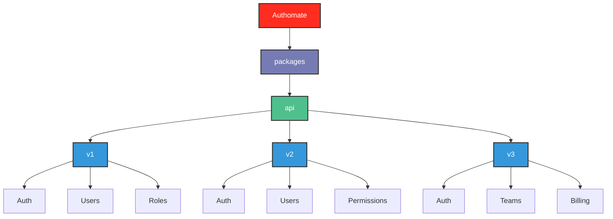

# Authomate - Technical Overview


> **Authomate** is my personal system for backend development. It's designed to stop me from repeating the same patterns across projects and to help me focus on building real functionality.

---

## Project Structure

```
authomate/
├── ABOUTME.md              # About the author
├── README.md               # Project introduction
├── OVERVIEW.md             # Technical overview (this file)
└── packages/
    └── api/
        ├── v1/             # API version 1
        │   ├── Auth/
        │   ├── Users/
        │   └── Roles/
        ├── v2/             # API version 2
        │   ├── Auth/
        │   ├── Users/
        │   └── Permissions/
        └── v3/             # API version 3
            ├── Auth/
            ├── Teams/
            └── Billing/
```

---

## Package Architecture (Authomate Source)



---

## Laravel Project Integration (Destination)

> When you want to use a package, download it from Authomate and place it in your Laravel project's controllers:

```mermaid
graph TD
    subgraph Authomate["Authomate (Source)"]
        AP[packages/api/v1/Auth]
        UP[packages/api/v1/Users]
    end
    
    subgraph Laravel["Your Laravel Project (Destination)"]
        L[YourProject] --> App[app]
        App --> Http[Http]
        Http --> Controllers[Controllers]
        Controllers --> LV1[v1]
        Controllers --> LV2[v2]
        
        LV1 --> LA[Auth]
        LV1 --> LU[Users]
        LV1 --> LR[Roles]
        
        LV2 --> LA2[Auth]
        LV2 --> LU2[Users]
        LV2 --> LP2[Permissions]
    end
    
    AP -.->|copy| LA
    UP -.->|copy| LU
    
    style Authomate fill:#1a1a2e,stroke:#FF2D20,stroke-width:2px
    style Laravel fill:#1a1a2e,stroke:#4FC08D,stroke-width:2px
    style AP fill:#FF2D20,stroke:#333,stroke-width:1px,color:#fff
    style UP fill:#FF2D20,stroke:#333,stroke-width:1px,color:#fff
    style LA fill:#4FC08D,stroke:#333,stroke-width:1px,color:#fff
    style LU fill:#4FC08D,stroke:#333,stroke-width:1px,color:#fff
```



**Example path mapping:**
| Authomate Package | Laravel Destination |
|-------------------|---------------------|
| `packages/api/v1/Auth` | `app/Http/Controllers/v1/Auth` |
| `packages/api/v1/Users` | `app/Http/Controllers/v1/Users` |
| `packages/api/v2/Permissions` | `app/Http/Controllers/v2/Permissions` |

---

## What Authomate Does

| Feature | Description |
|---------|-------------|
|  | Backend building blocks I always implement |
|  | Assemble functionality without rewriting code |
|  | Keeps development speedy while avoiding repetition |

---

## How I Use It

- Start a new project and include only what I need
- Everything follows consistent standards
- Fix a pattern once, use it everywhere

---

## Development Philosophy

| Principle | Meaning |
|-----------|----------|
|  | Only what I actually need |
|  | Designed for JSON APIs |
|  | Each piece works independently |
|  | Built for me and my workflow |

---

## Development Environment

> The environment I used to build Authomate:

### Host System


### Terminal & Shell


### Version Control


### Databases & Caching


### Containers & Monitoring


### API Testing


> **Postman** is essential for testing all Authomate APIs during development.

### Browser


---

> *Authomate is my personal toolkit for building backend systems efficiently and consistently.*
